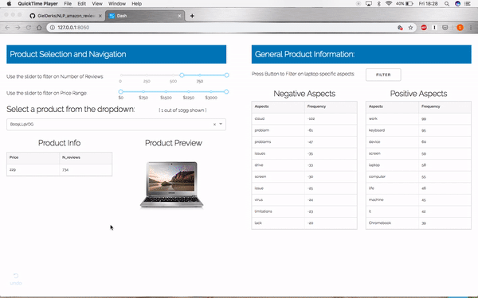

# Extracting postive and negative aspects of laptops Natural Language Processing 

Opinion mining is a type of natural language processing for tracking the opinion of the public about a particular product.

For example, a review on a website might be broadly positive about a laptop, but be specifically negative about how heavy it is. The goal of this model/app is to obtain granular insights into what reviewers like about a product.

The following tools, libraries and data were used to build this pipeline:

- Spacy library (tokenization, sentence boundary detection, dependency parser, etc.)
- Scikit Learn (python machine learning lib)
- Neural Coref (pre-trained neural network model for recognizing and replacing pronouns)
- Annotated Laptop Reviews — Laptop reviews that were manually labeled into categories
- Opinion lexicon (dictionaries with positive and negative words)

Human annotated laptop reviews are used to train a model that identifies terms that are part of the overall opinion for a product, such as battery life and screen in a sentence.

The sentence / phrase is classified as positive – neutral – negative.

# App Demo

